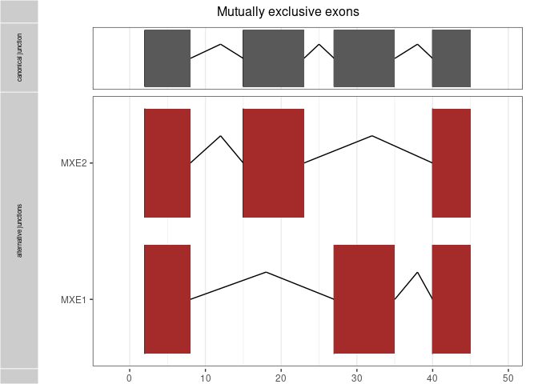

<!-- README.md is generated from README.Rmd. Please edit that file -->

# splice2neo

<!-- badges: start -->

[](https://github.com/TRON-Bioinformatics/splice2neo/actions)
[](https://codecov.io/gh/TRON-Bioinformatics/splice2neo?branch=master)
[](https://github.com/TRON-Bioinformatics/splice2neo)
[](https://lifecycle.r-lib.org/articles/stages.html#experimental)
[](https://github.com/TRON-Bioinformatics/splice2neo/commits/dev)
<!-- badges: end -->

[1. Overview](##1-Overview)  
[2. Installation](##2-Installation)  
[3. Example](##3-Example)  
[4. Dummy workflow](##4-Dummy-workflow)  
[5. Building the transcript
database](##5-Building-the-transcript%20database)  
[6. Requantification with
Easyquant](##6-Requantification-with-Easyquant)

## 1 Overview

This package provides functions for the analysis of splice junctions and
their association with somatic mutations. It integrates the output of
several tools which predict splicing effects from mutations or which
detect expressed splice junctions from RNA-seq data into a standardized
splice junction format based on genomic coordinates. Detected splice
junctions can be filtered against canonical splice junctsion and
annotated with affected transcript sequences, CDS, and resulting peptide
sequences. Splice2neo currently supports splice events from alternative
3’/5’ splice sites, exons skipping, intron retentions, exitrons and
mutually exclusive exons.  
Integrating splice2neo functions and detection rules based on splice
effect scores and RNA-seq support facilitates the identification of
mutation-associated splice junctions which are tumor-specific and can
encode neoantigen candidates.

Website: <https://tron-bioinformatics.github.io/splice2neo/>




### 1.1 Splice junction format

In general, a splice junction is defined by the format:
`chr:start-end:strand` .  
Intron retentions are a special case. Here, the junctions is defined by
the exon-intron or intron-exon boundary, following the format
`chr:pos-(pos+1):strand`.  
Two junctions relating to the same intron retention event event will
generate the same transcript and peptide context sequence.

### 1.2 Building splice junctions

The table below describes the rules on how the left and right coordinate
of the splice junction (“chr:start-end:strand“) are determined based on
the predicted effect from SpliceAI and Pangolin. Pos refers to the
position that is predicted to be affected by the mutation. Upstream_end
and downstream_start refer to exon end or start coordinates. Splice
junctions that relate to an intron retention event are defined by the
rule `chr:pos-(pos+1):strand` and must cover an exon-intron boundary.
The strand_offset is +1 for transcript on the positive strand and -1
otherwise.

| effect        | event_type        | rule_left           | rule_right          |
|:--------------|:------------------|:--------------------|:--------------------|
| Donor loss    | intron retention  | pos                 | pos + strand_offset |
| Donor loss    | exon skipping     | upstream_end        | downstream_start    |
| Donor gain    | alternative 5prim | pos                 | downstream_start    |
| Acceptor loss | intron retention  | pos - strand_offset | pos                 |
| Acceptor loss | exon skipping     | upstream_end        | downstream_start    |
| Acceptor gain | alternative 3prim | upstream_end        | pos                 |

## 2 Installation

This R package is not yet on [CRAN](https://CRAN.R-project.org) or
[Bioconductor](https://www.bioconductor.org/). Therefore, you need to
install it from this repository.

``` r
## install.packages("remotes")
remotes::install_github("TRON-Bioinformatics/splice2neo")
```

## 3 Example

This is a basic example of how to use some functions.

``` r
library(splice2neo)

# load human genome reference sequence
requireNamespace("BSgenome.Hsapiens.UCSC.hg19", quietly = TRUE)
bsg <- BSgenome.Hsapiens.UCSC.hg19::BSgenome.Hsapiens.UCSC.hg19
```

### 3.1 Example data

We start with some example splice junctions provided with the package.

``` r
junc_df <- dplyr::tibble(
  junc_id = toy_junc_id[c(1, 6, 10)]
)

junc_df
#> # A tibble: 3 × 1
#>   junc_id                   
#>   <chr>                     
#> 1 chr2:152389996-152392205:-
#> 2 chr2:179415981-179416357:-
#> 3 chr2:179446225-179446226:-
```

### 3.2 Add transcripts

Next, we find the transcripts which are in the same genomic region as
the splice junction and that may be affected by the junction.

``` r
junc_df <- junc_df %>% 
  add_tx(toy_transcripts)

junc_df
#> # A tibble: 21 × 3
#>    junc_id                    tx_id           tx_lst      
#>    <chr>                      <chr>           <named list>
#>  1 chr2:152389996-152392205:- ENST00000409198 <GRanges>   
#>  2 chr2:152389996-152392205:- ENST00000172853 <GRanges>   
#>  3 chr2:152389996-152392205:- ENST00000397345 <GRanges>   
#>  4 chr2:152389996-152392205:- ENST00000427231 <GRanges>   
#>  5 chr2:152389996-152392205:- ENST00000618972 <GRanges>   
#>  6 chr2:152389996-152392205:- ENST00000413693 <GRanges>   
#>  7 chr2:152389996-152392205:- ENST00000603639 <GRanges>   
#>  8 chr2:152389996-152392205:- ENST00000604864 <GRanges>   
#>  9 chr2:152389996-152392205:- ENST00000420924 <GRanges>   
#> 10 chr2:179415981-179416357:- ENST00000342992 <GRanges>   
#> # … with 11 more rows
```

The `add_tx` function annotates all possible transcripts that overlap
with the splice junctions which can lead to large data sets containing
of many highly unlikely junction transcript combinations.  
We can select a subset of transcripts per junction that are more likely
to be affected by a junction with `choose_tx()`. Please note that this
function may loose relevant or keep irrelevant junction-transcripts in
particular in regions with mutliple isoforms with distinct splicing
pattern.

``` r
selected_junc_df <- junc_df %>% 
  choose_tx()

selected_junc_df
#> # A tibble: 21 × 4
#>    junc_id                    tx_id           tx_lst       putative_event_type
#>    <chr>                      <chr>           <named list> <chr>              
#>  1 chr2:152389996-152392205:- ENST00000409198 <GRanges>    ASS                
#>  2 chr2:152389996-152392205:- ENST00000172853 <GRanges>    ASS                
#>  3 chr2:152389996-152392205:- ENST00000397345 <GRanges>    ASS                
#>  4 chr2:152389996-152392205:- ENST00000427231 <GRanges>    ASS                
#>  5 chr2:152389996-152392205:- ENST00000618972 <GRanges>    ASS                
#>  6 chr2:152389996-152392205:- ENST00000413693 <GRanges>    ASS                
#>  7 chr2:152389996-152392205:- ENST00000603639 <GRanges>    ASS                
#>  8 chr2:152389996-152392205:- ENST00000604864 <GRanges>    ASS                
#>  9 chr2:152389996-152392205:- ENST00000420924 <GRanges>    ASS                
#> 10 chr2:179415981-179416357:- ENST00000342992 <GRanges>    ASS                
#> # … with 11 more rows
```

### 3.3 Modify transcripts with junctions

We modify the canonical transcripts by introducing the splice junctions.
Then we add the transcript sequence in a fixed-sized window around the
junction positions, the context sequence.

``` r
toy_junc_df
#> # A tibble: 17 × 2
#>    junc_id                    tx_id          
#>    <chr>                      <chr>          
#>  1 chr2:152389996-152392205:- ENST00000409198
#>  2 chr2:152389996-152390729:- ENST00000409198
#>  3 chr2:152389955-152389956:- ENST00000397345
#>  4 chr2:152388410-152392205:- ENST00000409198
#>  5 chr2:152388410-152390729:- ENST00000409198
#>  6 chr2:179415981-179416357:- ENST00000342992
#>  7 chr2:179415987-179415988:- ENST00000342992
#>  8 chr2:179415000-179416357:- ENST00000342992
#>  9 chr2:179445336-179446207:- ENST00000342992
#> 10 chr2:179446225-179446226:- ENST00000342992
#> 11 chr2:179445336-179446633:- ENST00000342992
#> 12 chr2:179642044-179642187:- ENST00000342992
#> 13 chr2:179642146-179642147:- ENST00000342992
#> 14 chr2:179642044-179642431:- ENST00000342992
#> 15 chr2:152226533-152226534:+ ENST00000460812
#> 16 chr2:152222731-152222732:+ ENST00000460812
#> 17 chr2:152388410-152388411:- ENST00000397345


junc_df <- toy_junc_df %>% 
  add_context_seq(transcripts = toy_transcripts, size = 400, bsg = bsg)


junc_df
#> # A tibble: 17 × 8
#>    junc_id                  tx_id tx_mo…¹ junc_…² cts_seq cts_j…³ cts_s…⁴ cts_id
#>    <chr>                    <chr> <chr>     <int> <chr>   <chr>     <int> <chr> 
#>  1 chr2:152389996-15239220… ENST… ENST00…   16412 AAGAAG… 200         400 90bfc…
#>  2 chr2:152389996-15239072… ENST… ENST00…   16517 AAGAAG… 200         400 26f77…
#>  3 chr2:152389955-15238995… ENST… ENST00…   21620 AAGAAG… 0,200,…    1945 f1f2c…
#>  4 chr2:152388410-15239220… ENST… ENST00…   16412 AAGAAG… 200         400 d4f9e…
#>  5 chr2:152388410-15239072… ENST… ENST00…   16517 AAGAAG… 200         400 c715a…
#>  6 chr2:179415981-17941635… ENST… ENST00…   83789 TGGATT… 200         400 0128d…
#>  7 chr2:179415987-17941598… ENST… ENST00…   84158 TGGATT… 0,200,…     769 50119…
#>  8 chr2:179415000-17941635… ENST… ENST00…   83789 TGGATT… 200         400 c5083…
#>  9 chr2:179445336-17944620… ENST… ENST00…   59307 CGGGCT… 200         400 38759…
#> 10 chr2:179446225-17944622… ENST… ENST00…   59288 TTATCT… 0,200,…    1289 c4f9e…
#> 11 chr2:179445336-17944663… ENST… ENST00…   58982 TGGCTA… 200         400 4796f…
#> 12 chr2:179642044-17964218… ENST… ENST00…    4828 TAGAAG… 200         400 a4759…
#> 13 chr2:179642146-17964214… ENST… ENST00…    4868 TAGACC… 0,200,…     502 46a57…
#> 14 chr2:179642044-17964243… ENST… ENST00…    4703 GTCTCC… 200         400 77c18…
#> 15 chr2:152226533-15222653… ENST… ENST00…    3878 AAAACT… 0,76,3…    4078 b8f7a…
#> 16 chr2:152222731-15222273… ENST… ENST00…      76 AAAACT… 0,76,3…    4078 b8f7a…
#> 17 chr2:152388410-15238841… ENST… ENST00…   23165 AAGAAG… 0,200,…    1945 f1f2c…
#> # … with abbreviated variable names ¹​tx_mod_id, ²​junc_pos_tx, ³​cts_junc_pos,
#> #   ⁴​cts_size
```

### 3.4 Annotate peptide sequence

Finally, we use the splice junctions to modify the coding sequences
(CDS) of the reference transcripts. The resulting CDS sequences are
translated into protein sequence and further annotated with the peptide
around the junction, the relative position of the splice junction in the
peptide, and the location of the junction in an open reading frame
(ORF).

``` r

junc_df <- junc_df %>% 
  add_peptide(cds=toy_cds, flanking_size = 13, bsg = bsg)

junc_df %>% 
  dplyr::select(junc_id, peptide_context, peptide_context_junc_pos, junc_in_orf, cds_description, truncated_cds)
#> # A tibble: 17 × 6
#>    junc_id                    peptide_context    pepti…¹ junc_…² cds_d…³ trunc…⁴
#>    <chr>                      <chr>                <dbl> <lgl>   <chr>   <lgl>  
#>  1 chr2:152389996-152392205:- NRHFKYATQLMNEIC         13 TRUE    mutate… FALSE  
#>  2 chr2:152389996-152390729:- HLLAKTAGDQISQIC         13 TRUE    mutate… FALSE  
#>  3 chr2:152389955-152389956:- MLTALYNSHMWSQVMSD…      13 TRUE    mutate… FALSE  
#>  4 chr2:152388410-152392205:- NRHFKYATQLMNEIKYR…      13 TRUE    mutate… FALSE  
#>  5 chr2:152388410-152390729:- <NA>                    NA TRUE    trunca… TRUE   
#>  6 chr2:179415981-179416357:- SDPSKFTLAVSPVAGTP…      13 TRUE    mutate… FALSE  
#>  7 chr2:179415987-179415988:- SDPSKFTLAVSPVGK         13 TRUE    mutate… FALSE  
#>  8 chr2:179415000-179416357:- SDPSKFTLAVSPVVPPI…      13 TRUE    mutate… FALSE  
#>  9 chr2:179445336-179446207:- DVPDKHYPKDILSKYYQ…      13 TRUE    mutate… FALSE  
#> 10 chr2:179446225-179446226:- SDVPDKHYPKDILSKYY…      13 TRUE    mutate… FALSE  
#> 11 chr2:179445336-179446633:- SDASKAAYARDPQFPPE…      13 TRUE    mutate… FALSE  
#> 12 chr2:179642044-179642187:- SDSGEWTVVAQNRLWNIR      13 TRUE    mutate… FALSE  
#> 13 chr2:179642146-179642147:- AGRSSISVILTVEGKMR       13 TRUE    mutate… FALSE  
#> 14 chr2:179642044-179642431:- VGRPMPETFWFHDAVEH…      13 TRUE    mutate… FALSE  
#> 15 chr2:152226533-152226534:+ <NA>                    NA NA      no wt … NA     
#> 16 chr2:152222731-152222732:+ <NA>                    NA NA      no wt … NA     
#> 17 chr2:152388410-152388411:- MLTALYNSHMWSQVMSD…      13 TRUE    mutate… FALSE  
#> # … with abbreviated variable names ¹​peptide_context_junc_pos, ²​junc_in_orf,
#> #   ³​cds_description, ⁴​truncated_cds
```

## 4 Dummy workflow

In the following a dummy example workflow how to integrate predict
splicing effects from mutations or which detect expressed splice
junctions from RNA-seq data to predict potential neoantigen candidates
with splice2neo.  
Tools that predict splicing effect from somatic mutations can predict
distinct splice scores for the same mutation considering distinct genes.
If you want to consider gene annotation, please checkout
[4.1](###4.1-Consider-gene-annotation-in-mutation-tools)  
A test case will be added later

``` r
library(splice2neo)
library(tidyverse)
# load genome of choice
library(BSgenome.Hsapiens.UCSC.hg19)
library(AnnotationDbi)

# this is an example of a transcript database (see below for details)
gtf_url <- "ftp://ftp.ebi.ac.uk/pub/databases/gencode/Gencode_human/release_34/GRCh37_mapping/gencode.v34lift37.annotation.gtf.gz"
# parse GTF file as txdb object
txdb <- GenomicFeatures::makeTxDbFromGFF(gtf_url)

transcripts <-
  GenomicFeatures::exonsBy(txdb, by = c("tx"), use.names = TRUE)
transcripts_gr <- GenomicFeatures::transcripts(txdb, columns = c("gene_id", "tx_id", "tx_name"))
# Build a GRangesList with cds composed of individual exon ranges
cds <- GenomicFeatures::cdsBy(txdb, by = c("tx"), use.name = TRUE)

# canonical junctions
# the user can choose the best suited data sets for canonical junctions
# the object `canonical junction` should be a vector of canonical junctions in the junction format
canonical_juncs <-
  c("chr1:33361245-33361511:-",
    "chr1:32849649-32852380:-",
    "chrom:start-end:strand")
# OPTIONAL: if canonical junctions are available as a bed file, the user can transform the bed file into the juntion format:
# for bed files defined by exon-exon boundaries:
canonical_juncs <- bed_to_junc(bed_file = "/path/to/canonical/file.bed", type = "exon-exon")
# for bed files defined by introns:
canonical_juncs <- bed_to_junc(bed_file = "/path/to/canonical/file.bed", type = "intron")


# import RNA data
dat_leafcutter <-
  leafcutter_transform(path = "/your/path/to/leafcutter/results")
# supported events: exon_skip, intron_retention, alt_3prime, alt_5prime, mutex_exons
dat_spladder <-
  spladder_transform(path = "/your/path/to/spladder/results")
dat_rna <-
  generate_combined_dataset(spladder_juncs = dat_spladder, leafcutter_juncs = dat_spladder)

# import & transform SpliceAi results
dat_spliceai <-
  parse_spliceai(vcf_file = "path/to/spliceai/file.vcf")
dat_splicai_formatted <- format_spliceai(dat_spliceai)
dat_spliceai_annotated <-
  annotate_mut_effect(var_df = dat_splicai_formatted,
                      transcripts = transcripts,
                      transcripts_gr = transcripts_gr)

# get pangolin results and annotate effects as splice junctions
pangolin_file <- system.file("extdata", "spliceai_output.pangolin.vcf", package = "splice2neo")

pangolin_annot_df <- parse_pangolin(pangolin_file) %>%
  format_pangolin() %>%
  annotate_mut_effect(toy_transcripts, toy_transcripts_gr)


# import & transform MMSplice results
dat_mmsplice <- parse_mmsplice(infile = "path/to/mmsplice/file.csv")
dat_mmsplice_annotated  <-
  annotate_mmsplice(mmsplice_df = dat_mmsplice, transcripts = transcripts)

# filter for unique junctions transcripts and consider only the event with the best score
# this is recommended before combining the junctions from several tools
dat_spliceai_annotated_unique <- unique_mut_junc(dat_spliceai_annotated)
dat_pangolin_annotated_unique <- unique_mut_junc(pangolin_annot_df)
dat_mmsplice_annotated_unique <- unique_junc_mmsplice(dat_mmsplice_annotated)

# combine mutation-based junctions from several tools into one tibbles
dat_mut <- combine_mut_junc(list(
    "spliceai" = dat_spliceai_annotated_unique, 
    "mmsplice" = dat_mmsplice_annotated_unique,
    "pangolin" = dat_pangolin_annotated_unique
    ))

# add information if junction is canonical and if found to be expressed by SplAdder or LeafCutter
dat_mut <- dat_mut %>%
  mutate(is_canonical = is_canonical(junc_id, ref_junc = canonical_juncs, exons_gr = transcripts)) %>%
  mutate(is_in_rnaseq = is_in_rnaseq(junc_id, rna_juncs = dat_rna$junc_id))

# remove canonical junctions for further downstream analysis
dat_for_requantification <- dat_mut %>%
  filter(!is_canonical)

# add context sequences
# a list of GRanges with the transcript needs to be added at the moment
# this will be done within add_context_seq in a future version
dat_for_requantification_cts <- dat_for_requantification %>%
  add_context_seq(size = 400, bsg = BSgenome.Hsapiens.UCSC.hg19, transcripts = transcripts)


# transform to easyquant-format
dat_easyquant <- dat_for_requantification_cts %>%
  transform_for_requant()
write_delim(dat_easyquant, "path/to/easyquant/input/file.txt", delim = "\t")
# DO RE-QUANTIFICATION WITH EASYQUANT
# https://github.com/TRON-Bioinformatics/easyquant
# see Section 6 for more information on the requantifcation of splice junctions


# add peptide sequence
dat_for_requantification_cts_peptide <-
  dat_for_requantification_cts  %>%
  add_peptide(flanking_size = 13, bsg = BSgenome.Hsapiens.UCSC.hg19, cds = cds)

# merge EasyQuant results with data
dat_cts_peptide_requantification <-
  map_requant(path_to_easyquant_folder = "/path/to/easyquant/output_folder",
              junc_tib = dat_for_requantification_cts_peptide)


# EasyQuant results can be imported without direct merging with data
dat_requant <-
  read_requant(path_folder = "/path/to/easyquant/output_folder")

# annotate if there is a exon of another transcript within a predicted intron retention
dat_cts_peptide_requantification <- 
  dat_cts_peptide_requantification %>%
  mutate(exon_free = exon_in_intron(junc_id = junc_id, tx_id = tx_id, transcripts = transcripts))
```

### 4.1 Consider gene annotation in mutation tools

The currently supported tools that predict the effect of somatic
mutations on splicing consider gene annotations. These tools can predict
distinct splice scores for the same mutation in distinct genes.
Therefore, the user may want to consider only transcripts related to the
annotated gene during the annotation to prevent that combination of
junction-transcripts are matched with scores from another gene. The
following dummy example shows how to consider gene annotation during the
formatting and annotation of SpliceAI Pangolin results.

``` r
library(splice2neo)
library(tidyverse)
# load genome of choice
library(BSgenome.Hsapiens.UCSC.hg19)
library(AnnotationDbi)


# import & transform SpliceAi results
dat_spliceai <-
  parse_spliceai(vcf_file = "path/to/spliceai/file.vcf")
# add ENSEMBL gene id while formatting SpliceAI output
# gene_table is a tible with the columns gene_id (=ENSEMBL gene id)and gene_name (= gene symbol) 
dat_splicai_formatted <-
  format_spliceai(dat_spliceai, gene_table = gene_table)
# consider only transcript related to gene provided by SpliceAI
dat_spliceai_annotated <-
  annotate_mut_effect(
    var_df = dat_splicai_formatted,
    transcripts = transcripts,
    transcripts_gr = transcripts_gr,
    gene_mapping = TRUE
  )

# get pangolin results and annotate effects as splice junctions
pangolin_file <- system.file("extdata", "spliceai_output.pangolin.vcf", package = "splice2neo")

# keep gene_id while formatting of Pangolin output and onsider only transcript related to gene provided by Pangolin
pangolin_annot_df <- parse_pangolin(pangolin_file) %>%
  format_pangolin(keep_gene_id =TRUE) %>%
  annotate_mut_effect(toy_transcripts, toy_transcripts_gr, gene_mapping = TRUE)
```

## 5 Building the transcript database

A database of transcripts can be build from a GTF file, saved and
re-loaded as follows:

``` r
# use gtf file of choice and transform into transcript database
gtf_url <- "ftp://ftp.ebi.ac.uk/pub/databases/gencode/Gencode_human/release_34/GRCh37_mapping/gencode.v34lift37.annotation.gtf.gz"

# parse GTF file as txdb object
txdb <- GenomicFeatures::makeTxDbFromGFF(gtf_url)
saveDb(txdb, file = "/path/to/transripts/txdb.sqlite")

# load 
txdb <- loadDb("/path/to/transripts/txdb.sqlite")
```

## 6 Requantification with Easyquant

Splice2neo enables the user to transform junctions into a format so that
they can be quantified in RNA-seq data (`transform_for_requant`) using
Easyquant (<https://github.com/TRON-Bioinformatics/easyquant>, v0.4.0)
and to import results from this requantification (`map_requant` or
`read_requant`). The user can add columns containing information on the
read support for the given splice junction in this manner. The user may
be interested in different columns depending on the type of splice
event. Here, this are the most relevant columns for the different types
of events:

**Alternative splice sites & exon skipping events**:  
- *junc_interval_start*: Junction reads that map on the splice junction
of interest  
- *span_interval_start*: Spanning reads that frame the splice junction
of interest

**Intron retention**:  
- *within_interval*: Number of reads that map to the intron of
interest  
- *coverage_perc*: Relative read coverage of the intron of interest  
- *coverage_median*: Median read coverage of the intron of interest  
- *coverage_mean*: Mean read coverage of the intron of interest. This
value can be misleading by skewed read distribution and the user may
rather want to use the median coverage
